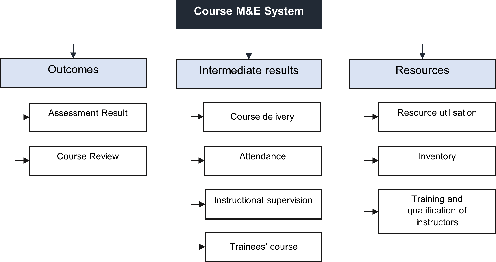

# 5.1. Course Finalization

The course finalisation process ensures the quality of the designed and developed courses before implanting them. While the perfection cannot be achieved or is a continuous process, the conduct of course finalisation must ensure to rid glaring and obvious errors or inaccuracies.

#### Course Finalization Process

## 5.1.1. Review by the SME

The Subject Matter Expert (SME) or the assigned assessor, in reviewing the course must check the following below. The reviewer must not be involved in the design and development process.

- Factual accuracy and validity of the course plan and instructional materials;
- Constructive alignment of training and learning outcomes, teaching and learning activities and assessment activities;
- Sufficiency of the course materials designed and developed;
- Grammar and spelling errors; and
- Overall quality of the training or course program.

All corrections and observations must be revised accordingly.

## 5.1.2	Pilot Testing

The conduct of the course pilot testing is to provide another validation of the course or training program. The instructor to conduct the pilot testing must not be part of the design and development process.

Specifically, the pilot testing checks for the following:

- Validity of the allotted time;
- Acceptance for the intended training recipient; and
- Efficiency of the course delivery.

# 5.2. Course Implementation

In ensuring that the courses are delivered as designed and developed, the following are must be taken into mind:

- Anticipating and resolving constraints during the course delivery;
- Ensuring that the instructor to deliver the course has the technical expertise, knowledge in teaching and learning effectively and is trained and briefed regarding the course;
- Ensuring that the training room or instruction area is conducive for learning;
- Ensuring the efficient coordination between personnel involved in the course delivery including the assessment part;
- Extending support services to the trainees to address their immediate concerns, especially those related to the course delivery; and
- Extending support such as in preparation of the training room, course materials, tools, equipment, etc. for the conduct of the course.

# 5.3.	Cource Monitoring

Continuous monitoring ensures that course implementation is according to the planned and desired outcome. The figure below outlines how oversight is structured in monitoring the course delivery.

#### Oversight diagram for course implementation

## 5.3.1	Course monitoring system

Course monitoring is just one part of the course monitoring and evaluation (M&E). In this manual, course evaluation is treated separately for the purpose of ensuring all areas are covered.

The M&E system covers three areas namely outcomes, intermediate results and resources as described in the figure below. 

Before the course is to be conducted and in the final review and approval in the course development phase, the course M&E framework is to be prepared by the RND and reviewed and approved by the COO and the Department Heads.

The course M&E framework contains the following:

- Components of the course M&E system
- Indicator
- Definition
- Baseline
- Target
- Data Source
- Frequency
- Responsible Person
- Reporting

#### Course M&E System

# 5.4. Review and Evaluation

The following are inputs in the course review:

- Course plan and instructional materials;
- Instructor’s comments and suggestions;
- New international and national standards; and
- New technology, discoveries, etc.

During the conduct of the course review, the assigned subject matter expert (course developer, instructor or assessor) checks for the accuracy and validity of the course materials and focuses in updating and enhancing the course materials.

A course evaluation is the holistic examination of courses which includes the results from course review as an input. The results in each component of the Course M&E System are collated and prepares (or assign the preparation of) the course evaluation report in coordination with the department heads, management and the subject matter experts.

A Course Review Committee meeting is to be held subjecting the report for scrutiny and outlining the action plan including course revision.

Major course revision which affects more than 50% of the course material must undergo with the same process as course design and course development before final review and approval.